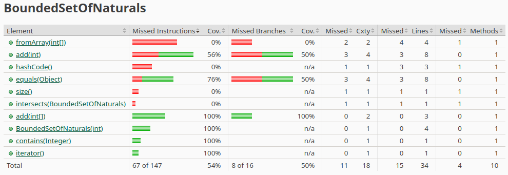
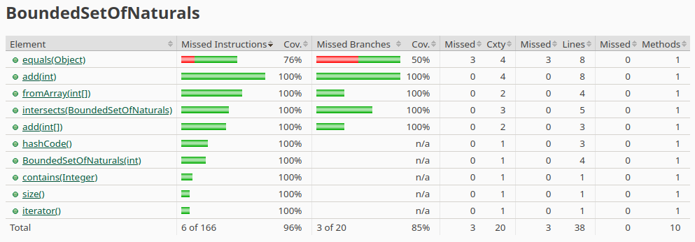

2. Que classes oferecem menos coverage?
    - Resposta: As classes que oferecem menos coverage são: 'CuponEuromillions' e 'BoundedSetOfNaturals'.
    - Nem todos os branchs de decisão estão cobertos.

Relatório Jacoco antes das alterações:

Relatório Jacoco depois das alterações:

Como podemos observar o coverage da class BoundedSetOfNaturals aumentou estando agora quase a 100%, os testes apresentavam uns 
erros de lógica que foram corrigidos, a class que estava menos coberta seria a classe add, os statements não estavam a ser testados.
E as classes HashCode, Equals e Iterator não estavam a ser testadas, por isso o coverage não era nem sequer aproximado a 100%.

